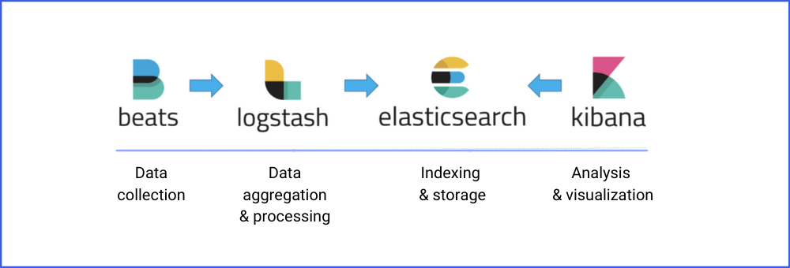
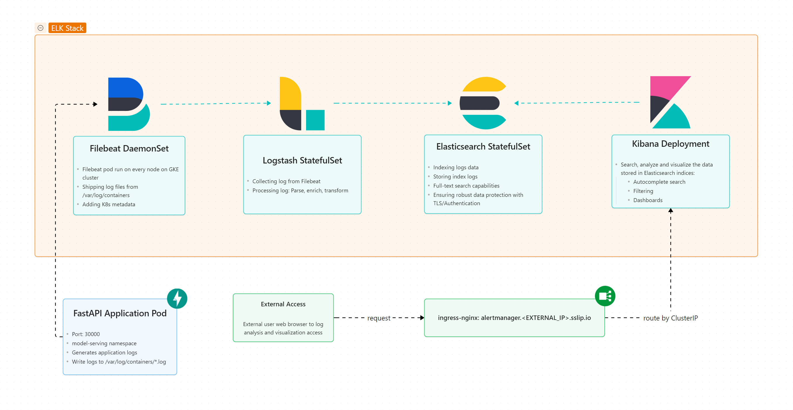

# ELK Stack

The ELK Stack is a popular open-source solution for collecting, searching, analyzing, and visualizing large volumes of data in real time. It consists of Elasticsearch, Logstash, and Kibana — three powerful tools that work together to help organizations handle logs and other data effectively. In most modern setups, Filebeat is also included as a lightweight agent that collects and forwards logs from servers to Logstash or Elasticsearch directly. While Elasticsearch stores and searches data, Logstash processes and transforms it, and Kibana visualizes it through dashboards. Together, these tools provide a complete solution for log management, system monitoring, and data analysis.





# Manual step-by-step Setting ELK

**Kubernetes Cluster**: Create namespace `logging`:

```bash
kubectl create ns logging
```

**Helm Repository**: Add this chart to Helm repo, it contains all repo for elasticsearch stack.

```bash
helm repo add elastic https://helm.elastic.co
helm repo update
```

---

## Elasticsearch

**Step 1**: Pull elasticsearch chart. We would use version `8.5.1`.

```bash
helm pull elastic/elasticsearch --version 8.5.1 --untar
```

**Step 2**: Editing elasticsearch configuration file `elasticsearch/values.yaml`.

2.1. Edit number of pods for testing.

```yaml
replicas: 1
minimumMasterNodes: 1
```

2.2. For clarity, we set our own password.

```yaml
# Disable it to use your own elastic-credential Secret.
secret:
  enabled: true
  password: "elastic123456" # generated randomly if not defined
```

2.3. For computational resources, we extend the limits of cpu and memory.

```yaml
resources:
  requests:
    cpu: "1000m"
    memory: "2Gi"
  limits:
    cpu: "1500m"
    memory: "4Gi"
```

2.4. We turn antiAffinity to sort. From the comment

> *Hard means that by default pods will only be scheduled if there are enough nodes for them and that they will never end up on the same node. Setting this to soft will do this "best effort"*
> 

```yaml
antiAffinity: "soft"
```

2.5. For clarity, we set `fullnameOverride = "elasticsearch”`

**Step 3**: Deploying Elasticsearch using Helm's `helm upgrade` command

```bash
helm upgrade --install elasticsearch helm-charts/elk-stack/elasticsearch -f helm-charts/elk-stack/elasticsearch/values.yaml --namespace logging
```

**Step 4**: After deploying elasticsearch, look into `elasticsearch-credentials` to get elasticsearch’s username and password

```bash
kubectl get secrets elasticsearch-credentials -o json -n logging
```

You would see password at data field (it is encoded with base64):

```bash
"data": {
  "password": "QXNpZEQ2MXo0a2RINHlncQ==", # elastic123456
  "username": "ZWxhc3RpYw==" # elastic
},
```

Get Elasticsearch credentials:

```bash
# Username (usually 'elastic')
kubectl get secret elasticsearch-credentials -n logging -o jsonpath='{.data.username}' | base64 --decode; echo

# Password
kubectl get secret elasticsearch-credentials -n logging -o jsonpath='{.data.password}' | base64 --decode; echo
```

## Filebeat

**Step 1**: Pull Filebeat chart. We would use version `8.5.1`.

```bash
helm pull elastic/filebeat --version 8.5.1 --untar
```

**Step 2**: Edit Filebeat configuration file `filebeat/values.yaml`

Change every `elasticsearch-master` to `elasticsearch` and make no other changes.

**Step 3**: Deploying Filebeat using Helm's `helm upgrade` command.

```bash
helm upgrade --install filebeat helm-charts/elk-stack/filebeat -f helm-charts/elk-stack/filebeat/values.yaml --namespace logging
```

## Logstash

**Step 1**: Pull Logstash chart. We would use version `8.5.1`.

```bash
helm pull elastic/logstash --version 8.5.1 --untar
```

**Step 2**: Edit Logstash configuration file `logstash/values.yaml`

2.1. Change every `elasticsearch-master` to `elasticsearch`.

2.2. We add extraEnvs variables.

```yaml
# Extra environment variables to append to this nodeGroup
# This will be appended to the current 'env:' key. You can use any of the kubernetes env
# syntax here
extraEnvs:
  - name: ELASTICSEARCH_USERNAME
    valueFrom:
      secretKeyRef:
        name: elasticsearch-credentials
        key: username
  - name: ELASTICSEARCH_PASSWORD
    valueFrom:
      secretKeyRef:
        name: elasticsearch-credentials
        key: password
```

2.3. We configure Logstash pipeline

```yaml
# Allows you to add any pipeline files in /usr/share/logstash/pipeline/
### ***warn*** there is a hardcoded logstash.conf in the image, override it first
logstashPipeline:
  logstash.conf: |
    input {
      beats {
        port => 5044
      }
    }
    output {
      elasticsearch {
        hosts => "https://elasticsearch:9200"
        cacert => "/usr/share/logstash/config/elasticsearch-certs/ca.crt"
        user => "${ELASTICSEARCH_USERNAME}"
        password => "${ELASTICSEARCH_PASSWORD}"
      }
    }
```

2.4. Mount secrets

```yaml
# A list of secrets and their paths to mount inside the pod
secretMounts:
  - name: "elasticsearch-certs"
    secretName: "elasticsearch-certs"
    path: "/usr/share/logstash/config/elasticsearch-certs"
```

2.5. Configure service

```yaml
service:
  annotations: {}
  type: ClusterIP
  loadBalancerIP: ""
  ports:
    - name: beats
      port: 5044
      protocol: TCP
      targetPort: 5044
    - name: http
      port: 8080
      protocol: TCP
      targetPort: 8080
```

**Step 3**: Deploying Logstash using Helm's `helm upgrade` command.

```bash
helm upgrade --install logstash helm-charts/elk-stack/logstash -f helm-charts/elk-stack/logstash/values.yaml --namespace logging
```

## Kibana

**Step 1**: Pull Kibana chart. We would use version `8.5.1`.

```bash
helm pull elastic/kibana --version 8.5.1 --untar
```

**Step 2**: Edit Kibana configuration file `kibana/values.yaml`.

2.1. Since we set `fullnameOverride = "elasticsearch"`, change these variable name to match elasticsearch configuration. (You can get the name by `kubectl get secrets -n logging` )

```yaml
elasticsearchHosts: "https://elasticsearch:9200"
elasticsearchCertificateSecret: elasticsearch-certs
elasticsearchCertificateAuthoritiesFile: ca.crt
elasticsearchCredentialSecret: elasticsearch-credentials
```

2.2. Computational resource. We should keep the resources unchanged.

```yaml
resources:
  requests:
    cpu: "1000m"
    memory: "2Gi"
  limits:
    cpu: "1000m"
    memory: "2Gi"
```

2.3. For clarity, we set `fullnameOverride: "kibana"`.

**Step 3**: Deploying Kibana using Helm's `helm upgrade` command.

```bash
helm upgrade --install kibana helm-charts/elk-stack/kibana -f helm-charts/elk-stack/kibana/values.yaml --namespace logging
```

**Step 4**: Enable ingress:

```yaml
ingress:
  enabled: true
  className: "nginx"
  pathtype: Prefix
  annotations:
    {}
  hosts:
    - host: kibana.<EXTERNAL_IP>.sslip.io
      paths:
        - path: /
```

**Step 4**: Port-forwarding service `kibana` to access the UI.

```bash
kubectl port-forward svc/kibana 5601:5601 -n logging
```

Use elasticsearch’s username (elastic) and password to access to Kibana.

---

# Deploy with bash script

```bash
#!/bin/bash

# Environments
NAMESPACE="logging"

# Create namespace logging
echo "Checking namespace: $NAMESPACE"
if ! kubectl get namespace "$NAMESPACE" &>/dev/null; then
    echo "Namespace '$NAMESPACE' not found, creating..."
    kubectl create namespace "$NAMESPACE"
else
    echo "Namespace '$NAMESPACE' already existed, passing."
fi


# Install Elasticsearch
helm upgrade --install elasticsearch helm-charts/elk-stack/elasticsearch -f helm-charts/elk-stack/elasticsearch/values.yaml -n $NAMESPACE

# Install Filebeat
helm upgrade --install filebeat helm-charts/elk-stack/filebeat -f helm-charts/elk-stack/filebeat/values.yaml -n $NAMESPACE

# Install Logstash
helm upgrade --install logstash helm-charts/elk-stack/logstash -f helm-charts/elk-stack/logstash/values.yaml -n $NAMESPACE 

# Install Kibana
helm upgrade --install kibana helm-charts/elk-stack/kibana -f helm-charts/elk-stack/kibana/values.yaml -n $NAMESPACE
```

## Uninstall ELK deployment

```bash
helm uninstall kibana --namespace logging
helm uninstall filebeat --namespace logging
helm uninstall logstash --namespace logging
helm uninstall elasticsearch --namespace logging
```


## Notice: Delete Kibana when facing error while upgrade helm chart
```bash
kubectl delete configmap kibana-helm-scripts -n logging
kubectl delete serviceaccount pre-install-kibana -n logging
kubectl delete roles pre-install-kibana -n logging
kubectl delete rolebindings pre-install-kibana -n logging
kubectl delete job pre-install-kibana -n logging
kubectl delete secrets kibana-es-token -n logging
```

# References

[Elastic Stack Kubernetes Helm Charts](https://github.com/elastic/helm-charts)

