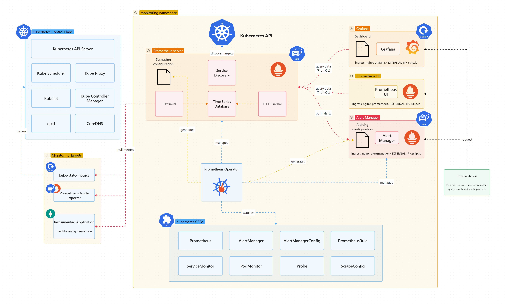

# Kube Prometheus Stack


## Kube Prometheus Stack Components
Component included in kube-prometheus-stack are:

-------------------------------------------------------------
| Component           | Type | Port            | Purpose    |
|---------------------|------|-----------------|------------|
| Prometheus Operator | Deployment | TCP port 8080 | Simplifying and automating the deployment, configuration, and management of Prometheus and related monitoring components in Kubernetes using Custom Resources. |
| Prometheus Server | StatefulSet | TCP port 9090 | Collecting, storing, and querying time-series data (metrics) from various targets like servers and applications. |
| Alertmanager | StatefulSet | TCP port 9093 | Handling alerts from monitoring systems. |
| Prometheus Node Exporter | Daemonset | TCP port 9100 | Collecting metrics from each cluster node. |
| Kube State Metrics | Deployment | TCP port 8080 | Listening to the Kubernetes API server and generating metrics about the state of the kubernetes’ objects. |
| Grafana | Deployment | TCP port 3000 | Visualization tool. |
-----------------------------------------------------



## Metrics For Kubernetes System Components

Kubernetes components exposing metrics in Prometheus format:

- `kube-controller-manager` (exposing metrics endpoint at TCP 10257)
- `kube-proxy` (exposing /metrics endpoint at TCP 10249)
- `kube-apiserver` (exposing /metrics at Kubernetes API port TCP 6443)
- `kube-scheduler` (exposing /metrics endpoint at TCP 10259)
- `kubelet` (exposing `/metrics`, `/metrics/cadvisor`, `/metrics/resource` and `/metrics/probes` endpoints at TCP 10250)

Additionally `coreDNS` and `etcd` database can be monitored. They both expose Prometheus.

## About Prometheus Operator

Prometheus operator manages Prometheus and AlertManager deployments and their configuration through the use of Kubernetes CRD (Custom Resource Definitions):

- `Prometheus` and `AlertManager` CRDs: declaratively defines a desired `Prometheus`/`AlertManager` setup to run in a Kubernetes cluster. It provides options to configure the number of replicas and persistent storage.
- `ServiceMonitor`/`PodMonitor`/`Probe`/`ScrapeConfig` CRDs: manages `Prometheus` service discovery configuration, defining how a dynamic set of services/pods/static-targets should be monitored.
- `PrometheusRules` CRD: defines Prometheus’ alerting and recording rules. Alerting rules, to define alert conditions to be notified (via `AlertManager`), and recording rules, allowing `Prometheus` to precompute frequently needed or computationally expensive expressions and save their result as a new set of time series.
- `AlertManagerConfig` CRD defines `Alertmanager` configuration, allowing routing of alerts to custom receivers, and setting inhibition rules.

## Monitoring Flow

1. **Management**
   The **Prometheus Operator** manages the lifecycle of Prometheus and Alertmanager instances, along with their configurations, through Kubernetes Custom Resource Definitions (CRDs).

2. **Metrics Collection**

   * **Prometheus** scrapes metrics from various targets, including applications, cluster nodes, and Kubernetes control plane components.
   * It leverages exporters such as **Node Exporter** (for node-level metrics) and **kube-state-metrics** (for Kubernetes object states).
   * Dynamic targets are discovered and scraped using **ServiceMonitor**, **PodMonitor**, and other CRDs.

3. **Visualization**

   * **Grafana** queries Prometheus using PromQL.
   * Metrics are visualized in real-time through dashboards, providing detailed insights into the performance and health of both the cluster and deployed applications.

4. **Alerting**

   * Prometheus evaluates alerting rules defined in **PrometheusRules CRDs**.
   * When conditions are met, alerts are sent to **Alertmanager**, which handles deduplication, grouping, and routing to notification channels (e.g., email, Slack, PagerDuty).


# Manual step-by-step Setting Prometheus

**Kubernetes Cluster**: Create namespace `tracing`:

```bash
kubectl create ns monitoring
```

**Helm Repository**: Add prometheus-community to Helm repo

```bash
helm repo add prometheus-community https://prometheus-community.github.io/helm-charts
helm repo update
```

---

**Step 1**: Pull kube-prometheus-stack chart. We would use version `77.5.0`.

```bash
helm pull prometheus-community/kube-prometheus-stack --version 77.5.0 --untar
```

**Step 2**: Editing kube-prometheus-stack configuration file `kube-prometheus-stack/values.yaml`

Keep default enable prometheus, grafana, alertmanager and enable ingress as below:

```yaml
prometheus:
  enabled: true
  ingress:
    enabled: true
    ingressClassName: nginx
    annotations:
      nginx.ingress.kubernetes.io/ssl-redirect: "false"
    hosts:
      - prometheus.<EXTERNAL_IP>.sslip.io
    path: /
    tls: []

grafana:
  enabled: true
  ingress:
    enabled: true
    ingressClassName: nginx
    annotations:
      nginx.ingress.kubernetes.io/ssl-redirect: "false"
    hosts:
      - grafana.<EXTERNAL_IP>.sslip.io
    path: /
    tls: []

alertmanager:
  enabled: true
  ingress:
    enabled: true
    ingressClassName: nginx
    annotations:
      nginx.ingress.kubernetes.io/ssl-redirect: "false"
    hosts:
      - alertmanager.<EXTERNAL_IP>.sslip.io
    path: /
    tls: []

# Control Plane Monitoring
kubeApiServer:
  enabled: true
kubelet:
  enabled: true
kubeControllerManager:
  enabled: true
kubeScheduler:
  enabled: true
kubeProxy:
  enabled: true
kubeEtcd:
  enabled: true
coreDns:
  enabled: true
```

**Step 3**: Access URLs

Our monitoring stack is accessible via:

- Grafana: http://grafana.<EXTERNAL_IP>.sslip.io (admin/[password from script below])
- Prometheus: http://prometheus.<EXTERNAL_IP>.sslip.io
- Alertmanager: http://alertmanager.<EXTERNAL_IP>.sslip.io


```bash
# Get Grafana admin password manually
kubectl get secret kube-prometheus-stack-grafana -n monitoring -o jsonpath="{.data.admin-password}" | base64 --decode; echo

# Port forward for local access
kubectl port-forward -n monitoring svc/prometheus-grafana 3000:80
kubectl port-forward -n monitoring svc/prometheus-kube-prometheus-prometheus 9090:9090
kubectl port-forward -n monitoring svc/prometheus-kube-prometheus-alertmanager 9093:9093
```


## Uninstall kube-prometheus-stack deployment

```bash
helm uninstall kube-prometheus-stack --namespace monitoring
```

---

# Essential PromQL Queries

## 1. Basic health checks

```python
# Check if our app is being scraped
up{job="edu-pii-detection"}

# Request rate per second
sum(rate(http_requests_total{job="edu-pii-detection"}[1m]))

# Error rate percentage
sum(rate(http_requests_total{job="edu-pii-detection", status!="2.."}[5m])) /
sum(rate(http_requests_total{job="edu-pii-detection"}[5m])) * 100
```

## 2. Performance metrics

```python
# 95th percentile response time
histogram_quantile(0.95, sum by(le) (rate(http_requests_duration_second_bucket{job="edu-pii-detection"}[5m])))

# CPU usage
rate(process_cpu_seconds_total{job="edu-pii-detection"}[1m])

# Memory usage
process_resident_memory_bytes{job="edu-pii-detection"}
```

## 3. Traffic Analysis

```python
# Daily request volume
sum(increase(http_requests_total{job="edu-pii-detection"}[24h]))

# Requests by endpoint
sum by(handler) (rate(http_requests_total{job="edu-pii-detection"}[5m]))
```

# PromQL Functions Reference

| **Function**           | **Purpose**                                                                                   | **Example**                                                                | **Explanation**                                                                                         |
| ---------------------- | --------------------------------------------------------------------------------------------- | -------------------------------------------------------------------------- | ------------------------------------------------------------------------------------------------------- |
| `rate()`               | Calculate the per-second **average increase** of a counter over a given time window.          | `rate(http_requests_total[5m])`                                            | If `http_requests_total` increased by 300 in the last 5 minutes, `rate()` = 300 / 300s = **1 req/sec**. |
| `sum()`                | Aggregate values across time series (e.g., sum over instances, jobs, pods, etc.).             | `sum(memory_usage_bytes)`                                                  | Returns the **total memory usage** by adding up all series with the metric `memory_usage_bytes`.        |
| `increase()`           | Calculate the **total increase** of a counter over a given time window.                       | `increase(http_requests_total[10m])`                                       | If a counter grew from 100 → 400 in the last 10 minutes, result = **300 requests**.                     |
| `histogram_quantile()` | Estimate a **quantile (percentile)** from histogram buckets. Useful for latency distribution. | `histogram_quantile(0.95, rate(http_request_duration_seconds_bucket[5m]))` | Returns the **95th percentile request duration** (e.g., 95% of requests were faster than this value).   |


---
# References

[Prometheus Operator](https://prometheus-operator.dev/)

[kube-prometheus-stack](https://github.com/prometheus-community/helm-charts/tree/main/charts/kube-prometheus-stack)

[Prometheus Node Exporter](https://github.com/prometheus-community/helm-charts/tree/main/charts/prometheus-node-exporter)

[kube-state-metrics Helm Chart](https://github.com/prometheus-community/helm-charts/tree/main/charts/kube-state-metrics)

[Monitoring (Prometheus)](https://picluster.ricsanfre.com/docs/prometheus/#about-prometheus-operator)
